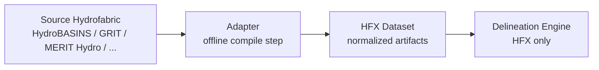

# HFX

HFX (HydroFabric Exchange) is an open specification and toolkit for a compiled drainage format that lets watershed delineation engines consume any source hydrofabric through a single normalized contract.

The core idea is simple: adapters compile source-specific hydrofabrics such as HydroBASINS, GRIT, or MERIT Hydro into HFX once, offline. Engines then consume HFX exclusively, with no fabric-specific logic in the hot path.

## Why HFX Exists

Every hydrofabric comes with its own topology model, file format, identifier scheme, and edge-case behavior. Engines that try to support multiple fabrics directly tend to accumulate fabric-specific branching throughout loading, traversal, snapping, and validation code.

HFX separates those concerns:

- Adapters handle source-specific ETL and normalization.
- The engine reads one compiled contract.
- Validation happens against the compiled dataset, not against every upstream source format.

## Architecture

This is a two-layer architecture:

1. Source-specific adapters run once and produce a self-contained HFX dataset.
2. The engine consumes only HFX artifacts and applies runtime traversal policy without knowing the source fabric.

## HFX Dataset Layout

An HFX dataset is a single folder containing these artifacts:

| Artifact | Purpose |
|---|---|
| `catchments.parquet` | Drainage unit polygons ("atoms"), Hilbert-sorted with bbox columns for row-group pruning |
| `graph.arrow` | Upstream adjacency graph stored as Arrow IPC for zero-copy loading |
| `snap.parquet` | Reach or node geometries used for outlet snapping with tiered ranking |
| `flow_dir.tif` | Optional COG flow-direction raster for terminal atom refinement |
| `flow_acc.tif` | Optional COG flow-accumulation raster paired with `flow_dir.tif` |
| `manifest.json` | Dataset metadata describing fabric identity, CRS, topology class, and raster encoding |

## v0.1 Scope

Current design boundaries for HFX v0.1:

- Inclusive upstream accumulation only.
- EPSG:4326 is required.
- Each dataset is self-contained in a single folder.
- The manifest describes the data, not engine traversal policy.
- The graph supports both tree and DAG topologies.
- Adapter implementation is intentionally out of scope for the spec: any tool that produces conformant artifacts is valid.

## Repository Scope

This repository is currently early scaffolding. The intended contents are:

- The HFX v0.1 specification in [HFX_SPEC.md](./HFX_SPEC.md)
- A standalone Rust validator for manifest shape, cross-file integrity, graph acyclicity, ID rules, bbox consistency, raster alignment, and geometry validity
- Future adapter implementations, starting with MERIT and GRIT

The full specification is the source of truth. The README is an orientation document; schema details and behavioral guarantees belong in the spec.

## Status

Language choice is Rust for the validator and future engine-facing tooling. Python bindings are planned later. At the moment, the repo still contains mostly boilerplate workspace scaffolding, so the immediate work is to shape the spec, validator, and crate layout around the HFX contract.
