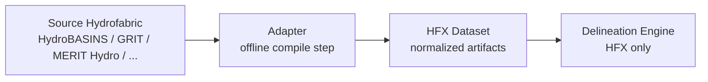

# HFX

HFX (HydroFabric Exchange) is an open specification and toolkit for a compiled drainage format that lets watershed delineation engines consume any source hydrofabric through a single normalized contract.

The core idea is simple: adapters compile source-specific hydrofabrics such as HydroBASINS, GRIT, or MERIT Hydro into HFX once, offline. Engines then consume HFX exclusively, with no fabric-specific logic in the hot path.

## Why HFX Exists

Every hydrofabric comes with its own topology model, file format, identifier scheme, and edge-case behavior. Engines that try to support multiple fabrics directly tend to accumulate fabric-specific branching throughout loading, traversal, snapping, and validation code.

HFX separates those concerns:

- Adapters handle source-specific ETL and normalization.
- The engine reads one compiled contract.
- Validation happens against the compiled dataset, not against every upstream source format.

## Architecture



This is a two-layer architecture:

1. Source-specific adapters run once and produce a self-contained HFX dataset.
2. The engine consumes only HFX artifacts and applies runtime traversal policy without knowing the source fabric.

## HFX Dataset Layout

An HFX dataset is a single folder containing these artifacts:

| Artifact | Purpose |
|---|---|
| `catchments.parquet` | Drainage unit polygons ("atoms"), Hilbert-sorted with bbox columns for row-group pruning |
| `graph.arrow` | Upstream adjacency graph stored as Arrow IPC for zero-copy loading |
| `snap.parquet` | Reach or node geometries used for weight-first outlet snapping with distance/mainstem tie-breakers |
| `flow_dir.tif` | Optional COG flow-direction raster for terminal atom refinement |
| `flow_acc.tif` | Optional COG flow-accumulation raster paired with `flow_dir.tif` |
| `manifest.json` | Dataset metadata describing fabric identity, CRS, topology class, and raster encoding |

## v0.1 Scope

Current design boundaries for HFX v0.1:

- Inclusive upstream accumulation only.
- EPSG:4326 is required.
- Each dataset is self-contained in a single folder.
- The manifest describes the data, not engine traversal policy.
- The graph supports both tree and DAG topologies.
- Adapter implementation is intentionally out of scope for the spec: any tool that produces conformant artifacts is valid.

## Repository Layout

This repository is organized as a spec-first monorepo:

| Path | Purpose |
|---|---|
| [`spec/`](./spec) | Canonical HFX specification and spec changelog |
| [`schemas/`](./schemas) | Machine-readable schema artifacts, starting with the manifest schema |
| [`examples/`](./examples) | Reference datasets and implementer-facing examples |
| [`conformance/`](./conformance) | Valid and invalid fixtures for validator and interoperability work |
| [`crates/`](./crates) | Rust toolkit crates, including shared logic and the validator CLI |
| [`adapters/`](./adapters) | Source-fabric compilers (GRIT working, MERIT scaffolded) |
| [`docs/decisions/`](./docs/decisions) | Short decision records for important spec and architecture choices |
| [`scripts/`](./scripts) | Repo helper scripts and release support utilities |

## Source Of Truth

The primary normative artifact is the development specification at [spec/HFX_SPEC.md](./spec/HFX_SPEC.md).

Supporting public interfaces live alongside it:

- [schemas/manifest.schema.json](./schemas/manifest.schema.json) defines the manifest contract in machine-readable form.
- [examples/](./examples) holds reference datasets for implementers.
- [conformance/](./conformance) holds validator fixtures and intentionally invalid datasets.

The validator and future adapters exist to serve the specification, not define it.

## Validator CLI

The validator is published as the `hfx-validator` crate and installs the `hfx` binary:

```bash
cargo install hfx-validator
hfx ./path/to/dataset
```

For machine-readable output:

```bash
hfx --format json ./path/to/dataset
```

- `--strict` promotes warnings to errors.
- `--skip-rasters` skips `flow_dir.tif` and `flow_acc.tif` checks.
- Exit code `0` means the dataset is valid; exit code `1` means it is invalid.

Validation behavior is defined against [spec/HFX_SPEC.md](./spec/HFX_SPEC.md).

## Datasets

### `merit_basins` — Global MERIT-Basins HFX (Pfafstetter Level-2)

The first complete global HFX dataset, compiled from MERIT-Basins v0.7 / v1.0_bugfix1 and the mghydro per-basin raster rehost.

| Property | Value |
|---|---|
| Adapter version | `0.1.0` |
| Format version | `0.1` |
| Atom count | 2,876,771 across 60 of 61 Pfaf-L2 basins |
| Bounding box | `[-178.03, -55.57, 179.89, 83.65]` (planetary) |

**Files:**

| Artifact | Size |
|---|---|
| `manifest.json` | 428 B |
| `graph.arrow` | 54 MB |
| `catchments.parquet` | 6.1 GB |
| `snap.parquet` | 1.7 GB |
| `flow_dir.tif` | 12 GB |
| `flow_acc.tif` | 45 GB |
| **Total** | **~65 GB** |

**Known gaps:** pfaf-35 (anti-meridian wrap — mghydro clips at 180°E); pfaf-87/88 (Antarctic sub-basins — absent from mghydro's distribution).

**Local path:** `~/Desktop/merit-hfx/global/hfx/` (operator-local; not yet hosted remotely).

**R2 hosting:** pending shed's `object_store` integration. See TODO.md Phase 4.

**Validate:**

```bash
hfx ~/Desktop/merit-hfx/global/hfx/ --strict --sample-pct 100
```

## Status

HFX v0.1 is the first published spec iteration. The Rust toolkit ships on crates.io: [`hfx-core`](https://crates.io/crates/hfx-core) and [`hfx-validator`](https://crates.io/crates/hfx-validator). The validator runs all documented check phases with a broad integration and conformance test suite, and a working [GRIT adapter](./adapters/grit/) demonstrates the end-to-end contract. Known conformance gaps (raster CRS/extent checks, reach-based snap, Hilbert parameters) are tracked in [docs/decisions/2026-04-13-post-grit-open-items.md](./docs/decisions/2026-04-13-post-grit-open-items.md).

Language choice is Rust for the validator and engine-facing tooling. Python bindings live in the downstream [shed](https://github.com/CooperBigFoot/shed) engine.
