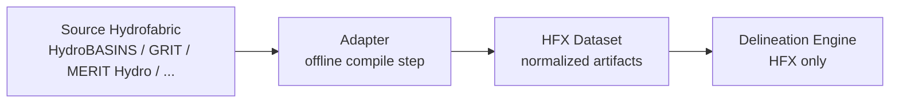

# HFX

HFX (HydroFabric Exchange) is an open specification and toolkit for a compiled drainage format that lets watershed delineation engines consume any source hydrofabric through a single normalized contract.

The core idea is simple: adapters compile source-specific hydrofabrics such as HydroBASINS, GRIT, or MERIT Hydro into HFX once, offline. Engines then consume HFX exclusively, with no fabric-specific logic in the hot path.

## Why HFX Exists

Every hydrofabric comes with its own topology model, file format, identifier scheme, and edge-case behavior. Engines that try to support multiple fabrics directly tend to accumulate fabric-specific branching throughout loading, traversal, snapping, and validation code.

HFX separates those concerns:

- Adapters handle source-specific ETL and normalization.
- The engine reads one compiled contract.
- Validation happens against the compiled dataset, not against every upstream source format.

## Architecture


```mermaid
flowchart LR
    A[Source Hydrofabric<br/>HydroBASINS / GRIT / MERIT Hydro / ...] --> B[Adapter<br/>offline compile step]
    B --> C[HFX Dataset<br/>normalized artifacts]
    C --> D[Delineation Engine<br/>HFX only]
```

This is a two-layer architecture:

1. Source-specific adapters run once and produce a self-contained HFX dataset.
2. The engine consumes only HFX artifacts and applies runtime traversal policy without knowing the source fabric.

## HFX Dataset Layout

An HFX dataset is a single folder containing these artifacts:

| Artifact | Purpose |
|---|---|
| `catchments.parquet` | Drainage-unit polygons, levels, parent links, outlets, and bbox columns for row-group pruning |
| `graph.parquet` | Same-level upstream adjacency graph |
| `snap.parquet` | Optional reach or node geometries used for outlet snapping |
| `manifest.json` | Dataset metadata describing fabric identity, CRS, topology class, counts, and auxiliary declarations |

Auxiliary data such as paired D8 rasters is declared in `manifest.json`, for
example with `hfx.aux.d8_raster.v1` entries pointing at `flow_dir.tif` and
`flow_acc.tif`.

## v0.2 Scope

Current design boundaries for HFX v0.2:

- Multi-level drainage units with explicit parent relationships.
- Same-level graph traversal only; cross-level hierarchy lives in `parent_id`.
- Optional snap features are separate from required unit outlets.
- Auxiliary artifacts are manifest-declared, not first-class core files.
- EPSG:4326 is required.
- Each dataset is self-contained in a single folder.
- The manifest describes the data, not engine traversal policy.
- The graph supports both tree and DAG topologies.
- Adapter implementation is intentionally out of scope for the spec: any tool that produces conformant artifacts is valid.

## Repository Layout

This repository is organized as a spec-first monorepo:

| Path | Purpose |
|---|---|
| [`spec/`](./spec) | Canonical HFX specification and spec changelog |
| [`schemas/`](./schemas) | Machine-readable schema artifacts, starting with the manifest schema |
| [`examples/`](./examples) | Reference datasets and implementer-facing examples |
| [`conformance/`](./conformance) | Valid and invalid fixtures for validator and interoperability work |
| [`crates/`](./crates) | Rust toolkit crates, including shared logic and the validator CLI |
| [`adapters/`](./adapters) | Source-fabric compilers (GRIT and MERIT, both working) |
| [`docs/decisions/`](./docs/decisions) | Short decision records for important spec and architecture choices |
| [`scripts/`](./scripts) | Repo helper scripts and release support utilities |

## Source Of Truth

The primary normative artifact is the development specification at [spec/HFX_SPEC.md](./spec/HFX_SPEC.md).

Supporting public interfaces live alongside it:

- [schemas/manifest.schema.json](./schemas/manifest.schema.json) defines the manifest contract in machine-readable form.
- [examples/](./examples) holds reference datasets for implementers.
- [conformance/](./conformance) holds validator fixtures and intentionally invalid datasets.

The validator and future adapters exist to serve the specification, not define it.

## Validator CLI

The validator is published as the `hfx-validator` crate and installs the `hfx` binary:

```bash
cargo install hfx-validator
hfx ./path/to/dataset
```

For machine-readable output:

```bash
hfx --format json ./path/to/dataset
```

- `--strict` promotes warnings to errors.
- `--skip-rasters` skips `flow_dir.tif` and `flow_acc.tif` checks.
- Exit code `0` means the dataset is valid; exit code `1` means it is invalid.

Validation behavior is defined against [spec/HFX_SPEC.md](./spec/HFX_SPEC.md).

## Datasets

Both reference datasets are hosted on Cloudflare R2 (kindly donated by [Upstream Tech](https://upstream.tech/)) and readable directly over HTTPS via range requests, so engines do not have to download them in full.

### `merit_basins` — Global MERIT-Basins HFX (Pfafstetter Level-2)

Compiled from MERIT-Basins v0.7 / v1.0_bugfix1 and the mghydro per-basin raster rehost.

| Property | Value |
|---|---|
| Adapter version | `0.1.0` |
| Format version | `0.1` |
| Topology | tree |
| Atom count | 2,876,771 across 60 of 61 Pfaf-L2 basins |
| Bounding box | `[-178.03, -55.57, 179.89, 83.65]` (planetary) |
| Manifest | <https://basin-delineations-public.upstream.tech/merit-basins/0.1.0/manifest.json> |

**Files:**

| Artifact | Size |
|---|---|
| `manifest.json` | 428 B |
| `graph.parquet` | Pending v0.2 republish; hosted v0.1 dataset uses the legacy graph artifact |
| `catchments.parquet` | 6.1 GB |
| `snap.parquet` | 1.7 GB |
| `flow_dir.tif` | 12 GB |
| `flow_acc.tif` | 45 GB |
| **Total** | **~65 GB** |

**Known gaps:** pfaf-35 (anti-meridian wrap — mghydro clips at 180°E); pfaf-87/88 (Antarctic sub-basins — absent from mghydro's distribution).

### `grit` — Global GRIT HFX

Compiled from the seven published [GRIT](https://zenodo.org/records/17435232) regions (`AF`, `AS`, `EU`, `NA`, `SA`, `SI`, `SP`) merged into one strict-valid dataset. Vector-only — GRIT does not ship paired rasters.

| Property | Value |
|---|---|
| Fabric version | `1.0.0` |
| Adapter version | `grit-regional-scratch-2026-04-30` |
| Format version | `0.1` |
| Topology | DAG (handles braiding and distributaries) |
| Atom count | 1,767,065 |
| Bounding box | global |
| Manifest | <https://basin-delineations-public.upstream.tech/grit/1.0.0/manifest.json> |

**Files:**

| Artifact | Size |
|---|---|
| `manifest.json` | 446 B |
| `graph.parquet` | Pending v0.2 republish; hosted v0.1 dataset uses the legacy graph artifact |
| `snap.parquet` | 3.4 GB |
| `catchments.parquet` | 9.6 GB |
| **Total** | **~13 GB** |

**Validate** any local copy of either dataset:

```bash
hfx ./path/to/dataset --strict
```

## Status

HFX v0.2 is the active spec direction. The Rust toolkit ships on crates.io: [`hfx-core`](https://crates.io/crates/hfx-core) and [`hfx-validator`](https://crates.io/crates/hfx-validator). Existing hosted GRIT and MERIT datasets are v0.1 examples until their adapters are updated to the v0.2 contract.

Language choice is Rust for the validator and engine-facing tooling. Python bindings live in the downstream [shed](https://github.com/CooperBigFoot/shed) engine.
