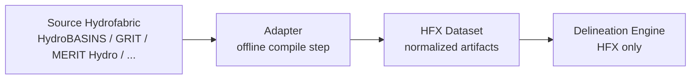

# HFX

> **Just want to delineate watersheds?** You do not need this spec. Install the Python package (`pip install pyshed`) or use the reference engine, shed ([github.com/CooperBigFoot/shed](https://github.com/CooperBigFoot/shed)). Read on only if you are building or validating HFX datasets.

HFX (HydroFabric Exchange) is an open specification and toolkit for a compiled drainage format that lets watershed delineation engines consume any source hydrofabric (a dataset describing a region's river network: the streams, how they connect, and the land area draining to each) through a single normalized contract.

The core idea is simple: adapters compile source-specific hydrofabrics such as HydroBASINS, GRIT, or MERIT Hydro into HFX once, offline. Engines then consume HFX exclusively, with no fabric-specific logic in the hot path.

## Why HFX Exists

Today a watershed delineation tool is usually wired to a single hydrofabric, so moving to a different fabric, or comparing results across several, means re-tooling the engine for each one's format, identifiers, and edge cases.
The same fragmentation blocks AI agents and automated pipelines, which need one documented, machine-checkable contract to target instead of many bespoke, often undocumented formats.
HFX is that contract, and it splits the work so each side stays simple:

- Adapters handle the source-specific ETL and normalization, once and offline.
- The engine reads one compiled contract, with no fabric-specific logic in its hot path.
- A validator checks each compiled dataset, instead of every upstream source format.

## Architecture


```mermaid
flowchart LR
    A[Source Hydrofabric<br/>HydroBASINS / GRIT / MERIT Hydro / ...] --> B[Adapter<br/>offline compile step]
    B --> C[HFX Dataset<br/>normalized artifacts]
    C --> D[Delineation Engine<br/>HFX only]
```

This is a two-layer architecture:

1. Source-specific adapters run once and produce a self-contained HFX dataset.
2. The engine consumes only HFX artifacts and applies runtime traversal policy without knowing the source fabric.

## HFX Dataset Layout

An HFX dataset is a single folder containing these artifacts:

| Artifact | Purpose |
|---|---|
| `catchments.parquet` | Drainage-unit polygons (the area of land draining to each river reach), levels, parent links, outlets, and bbox columns for row-group pruning (skipping blocks of the Parquet file whose bounding boxes cannot overlap a query, so a remote read fetches less data) |
| `graph.parquet` | Same-level upstream adjacency graph (a list of which drainage unit flows directly into which, used to traverse upstream) |
| `snap.parquet` | Optional reach or node geometries used for outlet snapping |
| `manifest.json` | Dataset metadata describing fabric identity, CRS, topology class (the network's connectivity model, e.g. whether flow paths only branch apart or can also rejoin), counts, and auxiliary declarations |

Auxiliary data such as paired D8 rasters (a matched pair of grids in the D8 flow
model, in which each cell drains to whichever of its 8 neighbors is steepest
downhill) is declared in `manifest.json`, for example with `hfx.aux.d8_raster.v1`
entries pointing at `flow_dir.tif` (the flow-direction grid) and `flow_acc.tif`
(the flow-accumulation grid, the number of upstream cells draining through each
cell).

## v0.2 Scope

Current design boundaries for HFX v0.2:

- Multi-level drainage units with explicit parent relationships.
- Same-level graph traversal only; cross-level hierarchy lives in `parent_id`.
- Optional snap features are separate from required unit outlets.
- Auxiliary artifacts are manifest-declared, not first-class core files.
- EPSG:4326 is required.
- Each dataset is self-contained in a single folder.
- The manifest describes the data, not engine traversal policy.
- The graph supports both tree and DAG topologies (in a tree, each drainage unit drains to exactly one downstream unit; in a DAG, a directed acyclic graph, a unit may drain to more than one downstream unit, as with braided or anabranching rivers, while flow never loops back on itself).
- Adapter implementation is intentionally out of scope for the spec: any tool that produces conformant artifacts is valid.

## Repository Layout

This repository is organized as a spec-first monorepo:

| Path | Purpose |
|---|---|
| [`spec/`](./spec) | Canonical HFX specification and spec changelog |
| [`schemas/`](./schemas) | Machine-readable schema artifacts, starting with the manifest schema |
| [`examples/`](./examples) | Reference datasets and implementer-facing examples |
| [`conformance/`](./conformance) | Valid and invalid fixtures for validator and interoperability work |
| [`crates/`](./crates) | Rust toolkit crates, including shared logic and the validator CLI |
| [`adapters/`](./adapters) | Source-fabric compilers (GRIT and MERIT, both working) |
| [`docs/decisions/`](./docs/decisions) | Short decision records for important spec and architecture choices |
| [`scripts/`](./scripts) | Repo helper scripts and release support utilities |

## Source Of Truth

The primary normative artifact is the development specification at [spec/HFX_SPEC.md](./spec/HFX_SPEC.md).

Supporting public interfaces live alongside it:

- [schemas/manifest.schema.json](./schemas/manifest.schema.json) defines the manifest contract in machine-readable form.
- [examples/](./examples) holds reference datasets for implementers.
- [conformance/](./conformance) holds validator fixtures and intentionally invalid datasets.

The validator and future adapters exist to serve the specification, not define it.

## Validator CLI

The validator is published as the `hfx-validator` crate and installs the `hfx` binary:

```bash
cargo install hfx-validator
hfx ./path/to/dataset
```

For machine-readable output:

```bash
hfx --format json ./path/to/dataset
```

- `--strict` promotes warnings to errors.
- `--skip-rasters` skips `flow_dir.tif` and `flow_acc.tif` checks.
- Exit code `0` means the dataset is valid; exit code `1` means it is invalid.

Validation behavior is defined against [spec/HFX_SPEC.md](./spec/HFX_SPEC.md).

## Datasets

One reference dataset is hosted on Cloudflare R2 and readable directly over HTTPS via range requests, so engines do not have to download it in full. [Upstream Tech](https://upstream.tech/) sponsors the hosting infrastructure (infrastructure sponsor only); it is not the publisher or vendor of the data.

### GRIT 2.0.0 HFX

An HFX compilation of the Global River Topology (GRIT) vector datasets, with segment (`level=0`) and reach (`level=1`) drainage units.

Manifest: <https://basin-delineations-public.upstream.tech/grit/hfx-v0.3.0/manifest.json>

| Property | Value |
|---|---|
| `format_version` | 0.3.0 |
| `fabric_name` | grit |
| `fabric_version` | 1.0.0 |
| `adapter_version` | grit-global-2.0.0 |
| `unit_count` | 22,337,300 |
| `topology` | dag |
| CRS | EPSG:4326 |
| Auxiliaries | two `hfx.aux.snap.v2` snap indexes (segment-stems, reach-stems) |
| Total size | ~43 GB (43,361,501,501 bytes) |

**Objects** (base URL `https://basin-delineations-public.upstream.tech/grit/hfx-v0.3.0/`):

- `manifest.json`
- `catchments.parquet`
- `graph.parquet`
- `aux/snap_segments.parquet`
- `aux/snap_reaches.parquet`
- `NOTICE`, `CITATION.txt`, `README.md` (attribution objects)

**License and attribution:** CC BY-NC 4.0 (<https://creativecommons.org/licenses/by-nc/4.0/>), inherited from the source data — NonCommercial use only. Any use of this dataset must credit the source data authors:

> Wortmann, M. et al. (2025) “Global River Topology (GRIT) vector datasets”. Zenodo. doi:10.5281/zenodo.17435232.

DOI: <https://doi.org/10.5281/zenodo.17435232>

**Validate** any local copy:

```bash
hfx ./path/to/dataset --strict
```

## Versioning

HFX carries two independent version tracks: the SPEC track is the format version itself (`format_version`, currently 0.3.0), while the TOOLKIT track covers the lockstep workspace crates `hfx-core` and `hfx-validator`, whose next curated release is 0.4.0 (implementing spec 0.3.0). See [docs/VERSIONING.md](./docs/VERSIONING.md) for the full policy, the spec-to-toolkit mapping table, and the release procedure.

## Implementations

HFX is the standard; engines and adapters implement it. [shed](https://github.com/CooperBigFoot/shed) is the reference engine implementation — it consumes HFX datasets directly and ships the Python bindings.

Contributions are welcome on the adapter side: a HydroBASINS adapter is the most-wanted next adapter. See [docs/ADAPTER_GUIDE.md](./docs/ADAPTER_GUIDE.md) for how to build one and [adapters/](./adapters) for the existing compilers.

## Status

HFX spec 0.3.0 is the current format version, and the hosted GRIT 2.0.0 dataset conforms to it. [`hfx-core`](https://crates.io/crates/hfx-core) and [`hfx-validator`](https://crates.io/crates/hfx-validator) 0.3.0 are published on crates.io; the next curated toolkit release, 0.4.0, implements spec 0.3.0.
