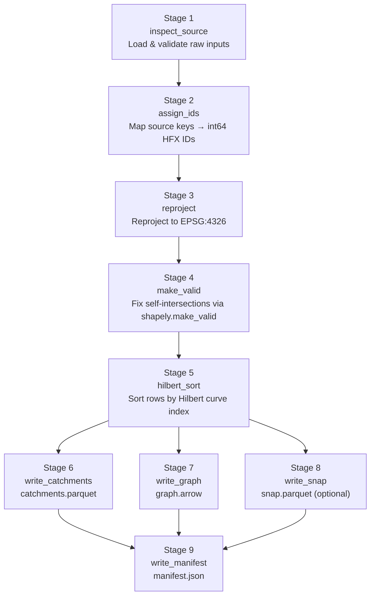

# HFX Adapter Template

Copy this directory to `adapters/<your-source>/` and implement the stage stubs. Do not edit `adapters/_template/` itself — it's the canonical skeleton.

## Pipeline at a glance



## What this template provides

- Pinned dependency stack matching the GRIT reference adapter: `geoparquet-io==1.0.0b2`, `pyarrow>=12,<23`, `geopandas>=1.1`, `shapely>=2`, `rasterio` — these floors and ceilings are imposed by `geoparquet-io==1.0.0b2`.
- Runnable `extract | build | validate` CLI via `argparse` subcommands.
- Implemented `build_geo_metadata()` helper that produces hand-crafted GeoParquet 1.1 `geo` JSON metadata (no `crs` key, which is correct per spec), ready to attach to an Arrow schema before opening `pq.ParquetWriter`.
- Implemented `validate()` helper that shells out to the `hfx` CLI validator and calls `validate_geoparquet` on `catchments.parquet` (and `snap.parquet` if `HAS_SNAP = True`).

## What this template does NOT provide

- Raster stages: if your fabric requires `flow_dir.tif` / `flow_acc.tif`, set `HAS_RASTERS = True` and add raster-copy or raster-conversion logic after stage 5.
- Source-specific ID mapping logic: only your adapter knows how to map source keys to stable `int64 > 0` HFX IDs.
- `up_area_km2` computation: if `HAS_UP_AREA = True`, stage 6 must populate the column; otherwise it is written as null and the engine computes it from graph traversal.
- `balanced_row_group_bounds` helper: adapters that ship more than 4096 atoms must implement or vendor this helper from `adapters/grit/build_grit_eu_hfx.py`. It distributes rows evenly across row groups whose size falls in `[ROW_GROUP_MIN, ROW_GROUP_MAX]` = `[4096, 8192]`.

## Getting started

```bash
cp -r adapters/_template adapters/<your-source>
cd adapters/<your-source>
uv sync
uv run python build_adapter.py extract --input <path-to-source>
```

## Where to learn more

- [`../../spec/HFX_SPEC.md`](../../spec/HFX_SPEC.md) — canonical data contract
- [`../../docs/ADAPTER_GUIDE.md`](../../docs/ADAPTER_GUIDE.md) — adapter authoring guide
- [`../grit/`](../grit/) — canonical worked example (GRIT Europe, 150K atoms, validated with `--strict --sample-pct 100`)
- [`../../crates/hfx-validator/README.md`](../../crates/hfx-validator/README.md) — validator CLI usage and known conformance gaps
