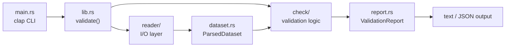

# hfx-validator

CLI tool that validates HFX dataset directories against `spec/HFX_SPEC.md`.

## Purpose

Reads an HFX dataset directory (manifest.json, catchments.parquet, graph.arrow, and optional snap.parquet / raster files) and reports all spec violations in a single pass.

## Architecture



Two layers, decoupled by `ParsedDataset`:

- **`reader/`** reads Parquet, Arrow IPC, TIFF, and JSON into lightweight intermediate representations (`CatchmentsData`, `GraphData`, `SnapData`, `RasterMeta`). These hold raw column arrays (`Vec<i64>`, `Vec<f32>`) so the validator can report ALL errors instead of failing fast on the first bad value.
- **`check/`** contains pure validation logic. Each module is free functions that take `&`-references to intermediate data and return `Vec<Diagnostic>`. No I/O, no trait objects.

## Key Types

| Type | Module | Role |
|---|---|---|
| `Diagnostic` | `diagnostic.rs` | Universal finding type (severity, category, artifact, location, message) |
| `ValidationReport` | `report.rs` | Aggregated result with text/JSON rendering |
| `ParsedDataset` | `dataset.rs` | Bridge between readers and checks |
| `RawManifest` | `reader/manifest.rs` | Serde struct with `Option<T>` fields for graceful error reporting |

## Validation Phases

Checks run in dependency order inside `check/mod.rs::run_checks()`:

1. File presence (manifest, catchments, graph, conditional snap/rasters)
2. Manifest field validation (13 checks)
3. Schema validation (column types, row group stats/sizes, atom_count match)
4. ID + value constraints (positivity, uniqueness, bbox validity, areas)
5. Cross-file referential integrity (graph-catchment coverage, upstream refs, snap FKs, bbox enclosure)
6. Graph acyclicity (Kahn's algorithm)
7. Geometry spot-check (WKB type + geozero validity, 1% sample for catchments)
8. Raster structural checks (dtype, tiling, nodata)

## Usage

```
hfx-validator <DATASET_PATH> [--format text|json] [--strict] [--skip-rasters] [--sample-pct N]
```

Exit codes: `0` = valid, `1` = invalid.

## Diagnostic Capping

The validator caps repetitive diagnostics to keep reports readable:

- **Per-row null violations**: When a non-nullable column contains more than 10 null values, the first 10 are reported individually with row indices. Remaining violations are summarised as a single diagnostic stating how many were suppressed.
- **Batch-read failures**: If 3 consecutive Parquet/Arrow record-batch reads fail (e.g., due to an unsupported compression codec or file corruption), the reader aborts early with a summary diagnostic rather than continuing to accumulate identical errors.

## Known Conformance Gaps

The following spec-required checks are **not implemented** and will emit warnings rather than errors:

| Spec Rule | Status | Reason | Tracking |
|---|---|---|---|
| Raster CRS must match manifest CRS | Not implemented | Requires GeoTIFF metadata parsing beyond what `tiff` 0.9 provides; needs GDAL or a GeoKeys parser | `raster.crs_extent_not_implemented` |
| Raster extent must contain manifest bbox | Not implemented | Same as above | `raster.crs_extent_not_implemented` |
| Hilbert sort order on catchments/snap rows | Deferred | Curve parameters not yet specified in the spec | Deferred |
| Polygon self-intersection / geometric validity | Partial | `geozero` checks WKB structural validity, not topological validity | Partial |
| Snap bbox strictness (`<=` for line features) | Fixed | Snap bboxes now correctly use `<=` rather than `<` for line-feature bbox enclosure | — |
| Parquet compression codecs (zstd, snappy, lz4, gzip) | Fixed | All four codecs are now supported; codec detection errors are reported via diagnostic capping | — |

A dataset that passes this validator with `--strict` is conformant on all checked rules. The unchecked rules above mean a passing result does **not** guarantee full spec conformance.
