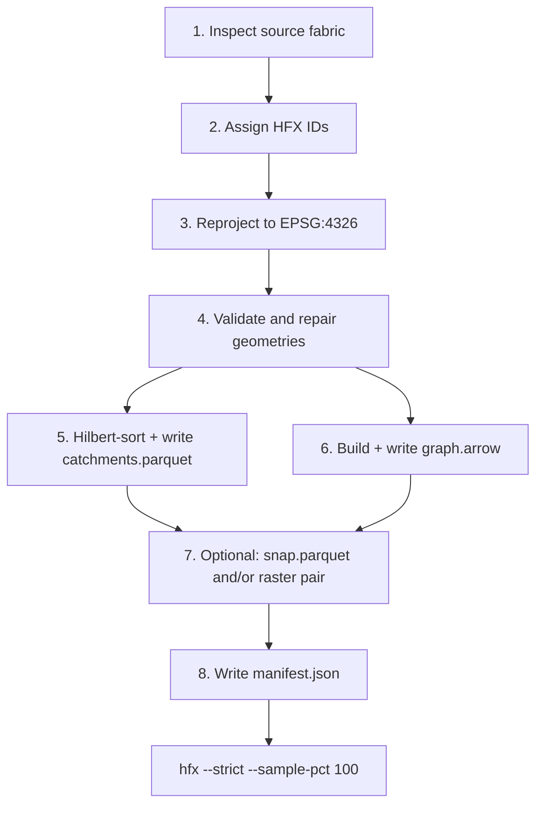

# HFX Adapter Guide

This guide is for engineers and LLM agents authoring a new HFX adapter — a tool that compiles a source hydrofabric (HydroBASINS, MERIT Hydro, HydroSHEDS, GRIT, or a custom fabric) into a conformant HFX dataset. It covers every production stage from raw input to a dataset that passes `hfx --strict --sample-pct 100`. It is not a substitute for reading the spec. Start there: [`spec/HFX_SPEC.md`](../spec/HFX_SPEC.md).

---

## Prerequisites

- Python 3.11 or later (adapters in this repo are Python; Rust adapters are also valid).
- `uv` for Python dependency management.
- `hfx` validator on `PATH`: `cargo install hfx-validator`.
- Full read of [`spec/HFX_SPEC.md`](../spec/HFX_SPEC.md) before writing any code.
- Key Python libraries: `geopandas`, `pyarrow`, `shapely`, `pyogrio`, `geoparquet-io==1.0.0b2`.

---

## Mental Model

The engine reads HFX only. It contains no fabric-specific logic. An adapter is a one-way offline compile step: raw source data in, conformant HFX artifacts out. Every HFX dataset is a flat directory with up to five artifacts — three required, two optional pairs:

| Artifact | Required | Description |
|---|---|---|
| `catchments.parquet` | Yes | Atom polygons, Hilbert-sorted, bbox stats enabled |
| `graph.arrow` | Yes | Upstream adjacency graph (Arrow IPC) |
| `manifest.json` | Yes | Dataset identity and engine parameters |
| `snap.parquet` | No | Outlet snapping targets; omit for polygon-only fabrics |
| `flow_dir.tif` + `flow_acc.tif` | No | Paired COG rasters for terminal atom refinement |

The two optional pairs are independent: snap but no rasters, rasters but no snap, both, or neither.

---

## Glossary

| Term | Definition |
|---|---|
| Adapter | Any tool that compiles a source hydrofabric into conformant HFX artifacts |
| Atom | Smallest indivisible drainage unit; one row of `catchments.parquet` |
| Terminal sink | Virtual outlet for the whole dataset; ID `0` is reserved as its sentinel |
| Headwater | Atom with no upstream neighbors; `upstream_ids = []` in `graph.arrow` |
| Topology: tree | Strictly convergent — each atom has at most one downstream neighbor |
| Topology: dag | Bifurcations present — one atom may drain to multiple downstream atoms |
| `up_area_km2` | Inclusive cumulative upstream drainage area: this atom's `area_km2` plus all upstream atoms |
| Hilbert sort | Row ordering by Hilbert curve index on centroid coordinates for spatial row-group pruning |
| Covering bbox (GeoParquet 1.1) | The optional `covering.bbox` struct column in the GeoParquet 1.1 spec; distinct from HFX's four top-level `bbox_*` float32 columns |
| Flow direction encoding | D8 convention in `flow_dir.tif`: `"esri"` (powers of 2) or `"taudem"` (1–8, E origin) |

---

## Pipeline Overview



Run the validator after each stage during development. Schema and ID errors caught early prevent cascading failures.

---

## Pipeline Stages

### 1. Inspect Source Fabric

Answer these questions before writing code. The answers drive `topology`, `has_up_area`, and `has_snap`:

- Does the fabric partition drainage area at bifurcations (like GRIT), or is each atom's area inclusive cumulative?
- Does the fabric supply explicit stream-line features, or is it polygon-only?
- Is the source already EPSG:4326, or does it need reprojection?
- Which field maps to HFX `id`? Must be `int64`, positive, unique. Check for zeros — `0` is reserved.

### 2. Assign HFX IDs

IDs must be `int64`, strictly positive (> 0), and unique within the dataset. ID `0` is the terminal sink sentinel and must never appear in `catchments.parquet` or `graph.arrow`. If the source uses string or UUID identifiers, create a stable integer mapping here and persist it for cross-table consistency.

### 3. Reproject to EPSG:4326

All vector and raster data must be EPSG:4326. Do not embed a bare `"EPSG:4326"` string in the Parquet schema — GeoParquet 1.1 requires a PROJJSON dict or no `crs` key (absence defaults to OGC:CRS84, semantically equivalent). See the §GeoParquet section below for the correct pattern.

### 4. Validate and Repair Geometries

Run `shapely.make_valid` (or `ST_MakeValid`) on every atom polygon before writing. Source fabrics frequently contain slivers, duplicate vertices, and self-touching rings. The validator performs a 1% WKB structural spot-check only. Validator does not check topological validity — adapter owns it. See [open item 3](decisions/2026-04-13-post-grit-open-items.md).

### 5. Hilbert-Sort and Write `catchments.parquet`

Sort rows by Hilbert curve index on centroid coordinates. This enables the engine to prune row groups via bbox column statistics.

```python
centroids = gdf.geometry.centroid
gdf["hilbert_index"] = centroids.hilbert_distance(total_bounds=gdf.total_bounds)
gdf = gdf.sort_values(["hilbert_index", "id"], kind="mergesort").reset_index(drop=True)
```

Files with fewer than 4,096 rows must be written as exactly one row group containing all rows. Files with 4,096 or more rows must use row groups of 4,096–8,192 rows each; use `balanced_row_group_bounds` (see §GeoParquet section) to distribute rows evenly. The four `bbox_*` columns must be `float32` with `write_statistics=True`. Do not use `write_geoparquet_table` — it controls row-group splitting internally and can violate the required layout. Use `pq.ParquetWriter` with hand-crafted GeoParquet metadata (§GeoParquet). After writing, call `validate_geoparquet(path, target_version="1.1")` as a build-time assertion.

Validator does not check Hilbert sort order — curve parameters are not yet specified in the spec. Adapter owns correct ordering. See [open item 1](decisions/2026-04-13-post-grit-open-items.md).

### 6. Build and Write `graph.arrow`

Produce an Arrow IPC file with columns `id` (`int64`) and `upstream_ids` (`list<int64>`). Every atom ID from `catchments.parquet` must appear exactly once. Headwaters get `upstream_ids = []`. Write using `pa.ipc.new_file`. The graph must be acyclic — detect and break cycles during ETL. The validator runs Kahn's algorithm, but fixing cycles after the fact is expensive.

### 7. Optional: `snap.parquet` and Raster Pair

**snap.parquet:** Provide when the source has explicit stream-line features. Omit (`has_snap = false`) for polygon-only fabrics.

The v0.2 `weight` contract: `weight` MUST be monotonically increasing in drainage dominance. A higher weight MUST indicate a more hydrologically significant reach. Use upstream drainage area (km² or cell count). Adapters writing `weight = upstream_area_km2` (GRIT, MERIT, HydroSHEDS) are conformant. Non-monotonic weights are non-conformant with v0.2 snapping semantics.

The engine default snap strategy is the weight-first cascade: filter by radius → rank by `weight` (highest preferred) → tie-break by `is_mainstem = true` → tie-break by distance → tie-break by `id` ascending. Set `is_mainstem = true` for all features in non-bifurcating fabrics.

Pad degenerate snap bboxes (horizontal or vertical lines where `minx == maxx` or `miny == maxy`) by epsilon (`1e-4`) before writing. Apply `balanced_row_group_bounds` and attach GeoParquet metadata, same as catchments.

**Raster pair:** Both `flow_dir.tif` and `flow_acc.tif` must be COG, EPSG:4326, with internal 256×256 or 512×512 tiles. `flow_dir.tif`: `uint8`, nodata = `255`. `flow_acc.tif`: `float32`, nodata = `-1.0` (not `int32` — overflows on large basins). The raster extent must fully contain the manifest `bbox`. Declare `flow_dir_encoding` (`"esri"` or `"taudem"`) in the manifest. Validator does not check raster CRS or extent containment — adapter owns it. See [open item 2](decisions/2026-04-13-post-grit-open-items.md).

### 8. Write `manifest.json`

```json
{
  "format_version": "0.1",
  "fabric_name": "my-fabric",
  "crs": "EPSG:4326",
  "has_up_area": true,
  "has_rasters": false,
  "has_snap": true,
  "terminal_sink_id": 0,
  "topology": "tree",
  "bbox": [-140.0001, 24.9999, -52.9999, 60.0001],
  "atom_count": 82341,
  "created_at": "2026-04-20T00:00:00Z",
  "adapter_version": "1.0.0"
}
```

`fabric_name`: lowercase ASCII, no whitespace. `created_at`: RFC 3339 UTC. `atom_count`: must equal row count of `catchments.parquet` exactly. `bbox`: pad outward by epsilon to absorb float32 rounding. `terminal_sink_id`: always `0`.

---

## GeoParquet and HFX Bbox Columns

Two distinct bbox mechanisms coexist in HFX Parquet files. Confusing them is a common conformance failure.

**HFX's four top-level `bbox_*` float32 columns are mandatory.** They are plain scalar columns — one value per row — that enable the engine to eliminate row groups via Parquet column statistics before deserializing any geometry. The validator checks type (`float32`), value constraints (`minx < maxx` for catchments, `<=` for snap), and statistics presence.

**GeoParquet 1.1 `covering.bbox` is a separate optional struct column.** Defined by the GeoParquet 1.1 spec for GeoParquet-aware readers. Not required by HFX. Both mechanisms may coexist in the same file.

The GRIT adapter (`adapters/grit/build_grit_eu_hfx.py`) uses this hand-crafted metadata pattern instead of `write_geoparquet_table`:

```python
import json
import pyarrow as pa
import pyarrow.parquet as pq

def build_geo_metadata(geometry_types: list[str]) -> dict[bytes, bytes]:
    # Omit "crs" — GeoParquet 1.1 defaults to OGC:CRS84, equivalent to EPSG:4326.
    # A bare "EPSG:4326" string violates the spec (requires PROJJSON dict or null).
    geo = {
        "version": "1.1.0",
        "primary_column": "geometry",
        "columns": {"geometry": {"encoding": "WKB", "geometry_types": geometry_types}},
    }
    return {b"geo": json.dumps(geo).encode("utf-8")}

schema = pa.schema([...])  # HFX columns including float32 bbox_* and binary geometry
schema = schema.with_metadata(build_geo_metadata(["Polygon", "MultiPolygon"]))

with pq.ParquetWriter(out_path, schema=schema, write_statistics=True) as writer:
    for start, stop in balanced_row_group_bounds(total_rows):
        writer.write_table(chunk_table)
```

Verify statistics are written after each file:

```python
meta = pq.read_metadata(str(out_path))
for i in range(meta.num_row_groups):
    for col in ["bbox_minx", "bbox_miny", "bbox_maxx", "bbox_maxy"]:
        assert meta.row_group(i).column(col).statistics is not None
```

---

## Topology Choice: Tree vs DAG

Set `topology = "tree"` for strictly convergent networks. Set `topology = "dag"` when bifurcations exist.

Topology determines `has_up_area`:

- **Tree, area pre-computed**: `has_up_area = true`; populate `up_area_km2` as inclusive cumulative area.
- **Tree or DAG, area not pre-computed**: `has_up_area = false`; leave `up_area_km2` null; engine computes at runtime.
- **DAG, area partitioned at bifurcations** (e.g., GRIT): source distributes area across branches rather than summing inclusively. Set `has_up_area = false`. Validator does not check the DAG summation algorithm — it is not yet formally specified. Adapter owns the decision. See [open item 4](decisions/2026-04-13-post-grit-open-items.md).

When uncertain, use `has_up_area = false`. Incorrect values produce silent correctness bugs; absent values are recoverable.

---

## Validator Gaps

The `hfx` validator does not check every spec requirement. For each gap, the adapter must enforce the rule in its ETL.

**Open item 1 — Hilbert sort order** ([decisions](decisions/2026-04-13-post-grit-open-items.md)): Spec requires Hilbert-sorted rows but does not define curve level or coordinate normalization. Validator cannot enforce order. Use `geopandas` `hilbert_distance` on centroids and sort ascending. Document curve parameters in the adapter.

**Open item 3 — Polygon topological validity** ([decisions](decisions/2026-04-13-post-grit-open-items.md)): Validator checks WKB structural validity via `geozero` but not DE-9IM topology (self-intersections, ring orientation). Run `shapely.make_valid` on every polygon before writing.

**Open item 4 — DAG `up_area_km2` algorithm** ([decisions](decisions/2026-04-13-post-grit-open-items.md)): For DAG fabrics with `has_up_area = true`, inclusive cumulative area requires a topological-sort summation with a visited set to avoid double-counting shared upstream atoms. Algorithm not yet formally specified in the spec. Validator does not check computed values.

---

## Adapter Author Checklist

### Catchments

- [ ] `id` is `int64`, positive (> 0), unique; `0` does not appear.
- [ ] `shapely.make_valid` applied to all geometries before writing.
- [ ] CRS is EPSG:4326; reprojection complete.
- [ ] Rows Hilbert-sorted by centroid coordinates.
- [ ] `bbox_*` columns are `float32`, non-null; `minx < maxx` and `miny < maxy` for every row.
- [ ] Files with fewer than 4,096 rows have one row group containing all rows; larger files use 4,096–8,192 rows per group with `balanced_row_group_bounds`.
- [ ] `write_statistics=True` on `pq.ParquetWriter`; bbox stats verified post-write.
- [ ] GeoParquet 1.1 `geo` metadata hand-crafted and attached before writer opens.
- [ ] `validate_geoparquet(path, target_version="1.1")` passes after write.
- [ ] `up_area_km2` value semantics match `has_up_area` declaration in manifest.

### Graph

- [ ] Every atom ID in `catchments.parquet` has exactly one row; headwaters have `upstream_ids = []`.
- [ ] All `upstream_ids` entries reference IDs in `catchments.parquet`.
- [ ] Graph is acyclic; cycles detected and broken during ETL.
- [ ] File is Arrow IPC format (not Parquet, not Feather v1).

### Snap (if `has_snap = true`)

- [ ] `weight` is `float32`, non-null, monotonically increasing in drainage dominance (validator does not check this).
- [ ] `is_mainstem` is `bool`, non-null.
- [ ] Degenerate snap bboxes inflated by epsilon.
- [ ] All `catchment_id` values exist in `catchments.parquet`.
- [ ] Row-group layout follows the same small-file/larger-file rule as catchments; GeoParquet metadata attached; `validate_geoparquet` passes.

### Rasters (if `has_rasters = true`)

- [ ] Both files present; COG with internal tiling.
- [ ] `flow_dir.tif`: `uint8`, nodata = `255`. `flow_acc.tif`: `float32`, nodata = `-1.0`.
- [ ] Raster CRS = EPSG:4326; extent fully contains manifest `bbox` (validator gap — adapter owns).
- [ ] `flow_dir_encoding` set to `"esri"` or `"taudem"` in manifest.

### Manifest

- [ ] `fabric_name` lowercase ASCII, no whitespace.
- [ ] `created_at` RFC 3339 UTC; `atom_count` equals row count of `catchments.parquet`.
- [ ] `bbox` encloses all atoms and is padded outward by epsilon.
- [ ] `terminal_sink_id = 0`; `topology`, `has_up_area`, `has_snap`, `has_rasters` all accurate.

### Validation

- [ ] `hfx <out_dir> --strict --sample-pct 100` exits with code `0`.

---

## Reference and Next Steps

- **Template**: `adapters/_template/` — skeleton adapter with stub functions for each stage.
- **Canonical worked example**: `adapters/grit/` — GRIT Europe is the reference implementation. `adapters/grit/build_grit_eu_hfx.py` contains `build_geo_metadata`, `balanced_row_group_bounds`, `inflate_degenerate_bounds`, `build_catchments`, `build_snap`, and `build_manifest`. `adapters/grit/WORKFLOW.md` has step-by-step commands.
- **Validator**: `crates/hfx-validator/README.md` — validation phases, conformance gaps, CLI flags.
- **Spec**: [`spec/HFX_SPEC.md`](../spec/HFX_SPEC.md) — the authoritative contract.

---

## Appendix A: Conformant Dataset Directory Layout

All artifacts are flat siblings — no subdirectories. The `hfx` validator path argument points to this directory.

```
my-fabric-hfx/
    manifest.json
    catchments.parquet
    graph.arrow
    snap.parquet          (optional)
    flow_dir.tif          (optional, must be paired with flow_acc.tif)
    flow_acc.tif          (optional, must be paired with flow_dir.tif)
```
