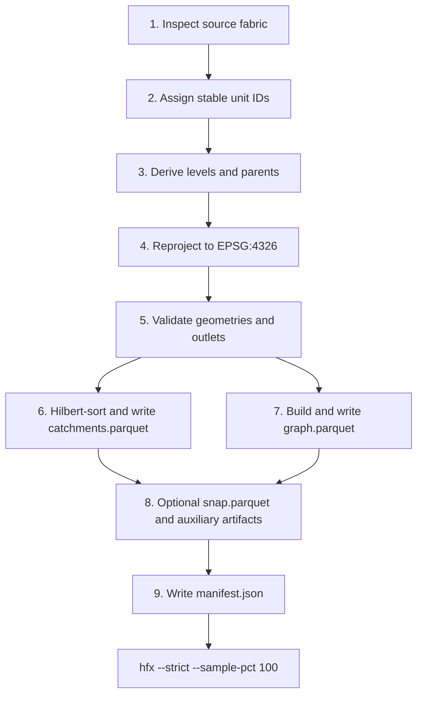

# HFX Adapter Guide

This guide is for engineers and LLM agents authoring a tool that compiles a
source hydrofabric into a conformant HFX v0.2 dataset. It is not a substitute
for the normative spec. Start there: [`spec/HFX_SPEC.md`](../spec/HFX_SPEC.md).

Adapters in this repository remain v0.1 until their own follow-up work lands.
This guide describes the v0.2 output contract.

---

## Prerequisites

- Python 3.11 or later for Python adapters; Rust or other languages are valid.
- `uv` for Python dependency management when using this repo's adapter pattern.
- `hfx` validator on `PATH`: `cargo install hfx-validator`.
- Full read of [`spec/HFX_SPEC.md`](../spec/HFX_SPEC.md).
- Typical Python libraries: `geopandas`, `pyarrow`, `shapely`, `pyogrio`,
  `geoparquet-io==1.0.0b2`.

---

## Mental Model

The engine reads HFX only. An adapter is a one-way offline compile step: raw
source data in, conformant HFX artifacts out.

An HFX v0.2 dataset is a flat directory with three required core artifacts and
optional declared extras:

| Artifact | Required | Description |
|---|---:|---|
| `catchments.parquet` | Yes | Drainage-unit polygons, levels, parents, outlets |
| `graph.parquet` | Yes | Same-level upstream adjacency graph |
| `manifest.json` | Yes | Dataset identity, topology, counts, auxiliary declarations |
| `snap.parquet` | No | Reach or node geometries used for outlet snapping |
| Auxiliary artifacts | No | Files declared in `manifest.json` under `auxiliary[]` |

Raster refinement inputs are auxiliary data in v0.2, not core files. The blessed
D8 raster schema is [`hfx.aux.d8_raster.v1`](../spec/aux/d8_raster/v1.md).

---

## Glossary

| Term | Definition |
|---|---|
| Adapter | Tool that compiles a source hydrofabric into conformant HFX artifacts |
| Drainage unit | One polygonal hydrologic unit at one dataset-local level; one row of `catchments.parquet` |
| Level | Dataset-local resolution tier; `0` is recommended as the coarsest tier |
| Parent | Containing coarser drainage unit referenced by `parent_id` |
| Unit outlet | Single EPSG:4326 coordinate where water exits a drainage unit |
| Headwater | Unit with no same-level upstream neighbors |
| Topology: tree | Strictly convergent; each unit has at most one downstream same-level neighbor |
| Topology: dag | Bifurcations present; one unit may drain to multiple downstream units |
| `up_area_km2` | Inclusive cumulative upstream area at the same level |
| Hilbert sort | Row ordering by Hilbert curve index on centroid coordinates for spatial row-group pruning |
| Auxiliary schema | Declared non-core data contract such as `hfx.aux.d8_raster.v1` |

---

## Pipeline Overview


```mermaid
flowchart TD
    A[1. Inspect source fabric] --> B[2. Assign stable unit IDs]
    B --> C[3. Derive levels and parents]
    C --> D[4. Reproject to EPSG:4326]
    D --> E[5. Validate geometries and outlets]
    E --> F[6. Hilbert-sort and write catchments.parquet]
    E --> G[7. Build and write graph.parquet]
    F --> H[8. Optional snap.parquet and auxiliary artifacts]
    G --> H
    H --> I[9. Write manifest.json]
    I --> J[hfx --strict --sample-pct 100]
```

Run the validator after each stage during development. Schema and ID errors
caught early prevent cascading failures.

---

## Pipeline Stages

### 1. Inspect Source Fabric

Answer these questions before writing code:

- Which source features become HFX drainage units?
- Which source fields define resolution tiers?
- Do available tiers nest perfectly, or should they be separate datasets?
- Does the source have explicit stream-line or node features for `snap.parquet`?
- Does the fabric partition drainage at bifurcations?
- Which source field maps to HFX `id`, and is it positive, unique, and stable?
- Which optional auxiliary artifacts should be declared?

### 2. Assign Stable Unit IDs

IDs must be `int64`, strictly positive, and unique within the dataset. `0` is
reserved and must never appear in `catchments.parquet`, `graph.parquet`, or
`snap.parquet`. If the source uses strings or UUIDs, create a stable integer
mapping and persist it for cross-table consistency.

### 3. Derive Levels and Parents

Each drainage unit has a dataset-local `level`. Recommended numbering uses
`level = 0` for the coarsest available tier and increasing values for finer
tiers.

Each finer unit should reference the next coarser available containing unit via
`parent_id`. If an intermediate source tier is absent from the HFX dataset,
`parent_id` skips to the next available coarser unit. Root units have null
`parent_id`.

The parent relation must form an acyclic forest. Parent levels must be strictly
coarser than child levels. Siblings must have disjoint interiors, and children
must tile their parent within validator tolerance.

### 4. Reproject to EPSG:4326

All vector data must be EPSG:4326. Do not embed a bare `"EPSG:4326"` string in
GeoParquet metadata; GeoParquet 1.1 requires a PROJJSON dict or no `crs` key
(absence defaults to OGC:CRS84, semantically equivalent). See the GeoParquet
section below.

### 5. Validate Geometries and Outlets

Run `shapely.make_valid` or `ST_MakeValid` on every drainage-unit polygon before
writing. Source fabrics often contain slivers, duplicate vertices, and
self-touching rings.

Every unit must have exactly one outlet coordinate:

- Flow-through units should put the outlet on the boundary shared with the
  downstream same-level unit.
- Terminal sinks should put the outlet inside the unit polygon for interior
  drainage or on the dataset boundary for a coastal terminus.
- DAG fork units should put the outlet at the fan-out boundary node.

Outlet tolerance is a validator parameter, not a manifest field.

### 6. Hilbert-Sort and Write `catchments.parquet`

Sort rows by Hilbert curve index on centroid coordinates. This enables engines
to prune row groups via bbox statistics.

```python
centroids = gdf.geometry.centroid
gdf["hilbert_index"] = centroids.hilbert_distance(total_bounds=gdf.total_bounds)
gdf = gdf.sort_values(["hilbert_index", "id"], kind="mergesort").reset_index(drop=True)
```

Required columns:

`id`, `level`, `parent_id`, `area_km2`, `up_area_km2`, `outlet_lon`,
`outlet_lat`, `bbox_minx`, `bbox_miny`, `bbox_maxx`, `bbox_maxy`, `geometry`.

Optional columns:

`source_id`, `level_label`.

Files with fewer than 4,096 rows must have one row group. Larger files use
4,096-8,192 rows per group. Write statistics for all `bbox_*` columns.

### 7. Build and Write `graph.parquet`

Produce a Parquet file with columns `id` (`int64`), `level` (`int16`), and
`upstream_ids` (`list<int64>`). Every unit ID from `catchments.parquet` must
appear exactly once. Headwaters get `upstream_ids = []`.

Graph edges are same-level only. Cross-level relationships belong in
`parent_id`. Detect and break cycles during ETL; fixing them after validation
is expensive.

### 8. Optional `snap.parquet` and Auxiliary Artifacts

Provide `snap.parquet` when the source has useful reach or node features.
Required columns are `id`, `unit_id`, `weight`, `stem_role`, `bbox_minx`,
`bbox_miny`, `bbox_maxx`, `bbox_maxy`, and `geometry`. The bbox columns are
nullable in v0.2. `stem_role` is nullable and may be `mainstem`, `tributary`, or
`unknown`.

Declare non-core artifacts in `manifest.json` under `auxiliary[]`. For D8
rasters:

```json
{
  "schema": "hfx.aux.d8_raster.v1",
  "artifacts": {
    "flow_dir": "flow_dir.tif",
    "flow_acc": "flow_acc.tif"
  },
  "metadata": {
    "flow_dir_encoding": "esri"
  }
}
```

`flow_dir.tif` must be a COG, `uint8`, NoData `255`, EPSG:4326, internally
tiled. `flow_acc.tif` must be a COG, `float32`, NoData `-1.0`, and share the
same CRS and tiling expectations.

### 9. Write `manifest.json`

```json
{
  "format_version": "0.2",
  "fabric_name": "my-fabric",
  "crs": "EPSG:4326",
  "has_up_area": true,
  "topology": "tree",
  "bbox": [-140.0001, 24.9999, -52.9999, 60.0001],
  "unit_count": 82341,
  "created_at": "2026-05-14T00:00:00Z",
  "adapter_version": "1.0.0"
}
```

`fabric_name` is lowercase ASCII with no whitespace. `created_at` is RFC 3339.
`unit_count` must equal the row count of `catchments.parquet`. `bbox` should
enclose all units and may be padded outward by epsilon, except planetary bounds
must not exceed `[-180, -90, 180, 90]`.

Removed v0.1 manifest fields must not be written: `has_rasters`, `has_snap`,
`fabric_level`, `flow_dir_encoding`, `terminal_sink_id`, and `atom_count`.

---

## GeoParquet and HFX Bbox Columns

HFX's four top-level `bbox_*` columns are mandatory for `catchments.parquet` and
optional for `snap.parquet`. They are plain scalar columns that enable engines
to eliminate row groups through Parquet column statistics before deserializing
geometry.

GeoParquet 1.1 `covering.bbox` is a separate optional struct column. Both
mechanisms may coexist.

Use hand-crafted GeoParquet metadata when you need exact row-group control:

```python
import json
import pyarrow as pa
import pyarrow.parquet as pq

def build_geo_metadata(geometry_types: list[str]) -> dict[bytes, bytes]:
    geo = {
        "version": "1.1.0",
        "primary_column": "geometry",
        "columns": {"geometry": {"encoding": "WKB", "geometry_types": geometry_types}},
    }
    return {b"geo": json.dumps(geo).encode("utf-8")}

schema = pa.schema([...])
schema = schema.with_metadata(build_geo_metadata(["Polygon", "MultiPolygon"]))

with pq.ParquetWriter(out_path, schema=schema, write_statistics=True) as writer:
    for start, stop in balanced_row_group_bounds(total_rows):
        writer.write_table(chunk_table)
```

Verify bbox statistics after each write.

---

## Topology Choice

Set `topology = "tree"` for strictly convergent networks. Set
`topology = "dag"` when bifurcations exist.

`up_area_km2` is same-level only:

- If inclusive same-level upstream area is precomputed, set `has_up_area = true`
  and populate `up_area_km2`.
- If it is absent or ambiguous, set `has_up_area = false` and leave
  `up_area_km2` null.
- For DAG fabrics that partition area at bifurcations, prefer
  `has_up_area = false` unless the source semantics are explicitly compatible
  with HFX's inclusive same-level definition.

When uncertain, omit upstream area. Incorrect values produce silent correctness
bugs; absent values are recoverable.

---

## Adapter Author Checklist

### Catchments

- [ ] `id` is `int64`, positive, unique; `0` does not appear.
- [ ] `level` is `int16` and non-negative.
- [ ] `parent_id` is null or references an existing coarser unit.
- [ ] Parent relation is acyclic.
- [ ] Sibling interiors are disjoint within tolerance.
- [ ] Finer units tile parent units within tolerance.
- [ ] `outlet_lon` and `outlet_lat` are finite WGS84 coordinates.
- [ ] Geometry is valid Polygon or MultiPolygon WKB.
- [ ] Rows are Hilbert-sorted by centroid coordinates.
- [ ] `bbox_*` columns are `float32`, non-null, ordered, and have statistics.
- [ ] GeoParquet 1.1 metadata is attached.

### Graph

- [ ] File is `graph.parquet`.
- [ ] Every unit has exactly one graph row.
- [ ] `level` matches the referenced catchment unit.
- [ ] All `upstream_ids` entries reference existing same-level units.
- [ ] Same-level graph is acyclic.

### Snap

- [ ] File is omitted when no useful snap features exist.
- [ ] `unit_id` values reference existing units.
- [ ] `stem_role` is null, `mainstem`, `tributary`, or `unknown`.
- [ ] Geometry is Point or LineString WKB.
- [ ] Nullable bbox columns are populated where spatial pruning is useful.

### Auxiliary

- [ ] Each `auxiliary[]` entry has `schema`, non-empty `artifacts`, and object
  `metadata`.
- [ ] Artifact paths are relative and stay inside the dataset root.
- [ ] `hfx.aux.d8_raster.v1` entries contain `flow_dir`, `flow_acc`, and
  `metadata.flow_dir_encoding`.
- [ ] Unknown third-party schemas use reverse-DNS style identifiers.

### Manifest

- [ ] `format_version = "0.2"`.
- [ ] `fabric_name` is lowercase ASCII, no whitespace.
- [ ] `created_at` is RFC 3339.
- [ ] `unit_count` equals the `catchments.parquet` row count.
- [ ] Removed v0.1 fields are not present.

### Validation

- [ ] `hfx --strict --sample-pct 100 ./dataset` passes.
- [ ] JSON Schema validation against `schemas/manifest.schema.json` passes.
- [ ] Any auxiliary metadata schema validation passes.
