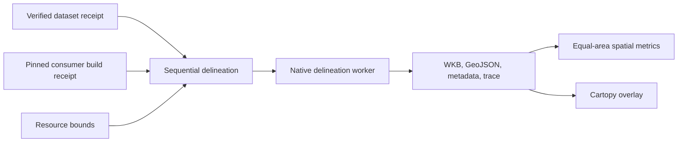

# Watershed comparison

This HFX-owned tool consumes explicit dataset/build evidence, delineates one
watershed per process, and compares preserved watershed outputs. Storage
promotion and payload verification belong to `scripts/dataset-delivery/`.
It makes no changes to the HFX contract or consumer source.



## Boundaries and evidence

- `models`: strict identity, geographic point and normal consumer settings.
- `consumer` and `native_data`: installed wheel, loaded-library and data identity.
- `manifest`: bounded credential-isolated observed manifest reads.
- `delineation`: one native session and one complete watershed result.
- `supervision`: sequential processes, credential isolation and resource gates.
- `overlay`: saved complete geometry to equal-area metrics and figure.
- `cli`: input files and process boundary. Failures exit 1 without automatic retry.

A drainage unit is one HFX polygonal hydrologic unit. A resolved outlet is the
consumer-selected geographic point. A refined outlet exists only when raster
refinement was applied. `area_km2` is the consumer's WGS84 ellipsoidal geodesic
area. Plot metrics use EPSG:3035 equal-area coordinates and square kilometres.

## Build and environment

Use Python 3.13 and `uv sync --frozen` in this directory. The plotting/execution
lock excludes the consumer deliberately: install the exact locally built wheel,
not the identically numbered PyPI package. Source SHA is fixed at
`7a43834a870d0f5d46ed6d23926205ee58c8fb93` from
`https://github.com/CooperBigFoot/pourpoint.git`. Released 0.3.0 lacks required
main-source typed refinement fields. Both source and release call themselves
0.3.0, so the version string cannot identify the build.

Create the detached consumer checkout only under the HFX `.worktrees/` directory.
From that checkout, build through the native maturin backend:

```bash
uv run --python 3.13 --with 'maturin>=1.7,<2' maturin build --release --locked --manifest-path crates/python/Cargo.toml --out /absolute/wheel-output
```

Record exact resolved maturin and Rust versions, Python ABI/platform, source SHA,
Cargo.lock SHA-256, wheel SHA-256, native extension SHA-256 and linked native
library paths/hashes. Keep build/test logs and this receipt outside regenerable
wheel/target directories. System GDAL/PROJ/GEOS participate in the build; preserve
those identities. Install the absolute wheel into this tool's environment:

```bash
uv pip install --python .venv/bin/python /absolute/wheel-output/pourpoint-0.3.0-cp39-abi3-macosx_11_0_arm64.whl
uv run --frozen --no-sync hfx-watershed --help
```

Use `--no-sync` for commands after wheel installation: ordinary exact sync can
remove the separately installed consumer. Never install a PyPI fallback. The
worker hashes the full installed wheel-owned package, including the Python facade
and any bundled data, before import. It verifies actual dyld-loaded resolved native
paths and hashes after initialization and after delineation. A supplemental
runtime-data receipt binds actual GDAL/PROJ lookup configuration and full local
data-directory inventories. Remote PROJ grids are disabled. The first absent
per-user PROJ candidate may relocate beneath isolated HOME only while remaining
absent; actual lookup paths are preserved. Existing directories must match exact
paths and hashes. These are file/config identity checks, not in-memory attestation
or a trace of every resource access. Apple shared-cache images remain separately
identified. GDAL's anchor lookup identifies its gdalvrt.xsd directory, with the
API guarantee stated in the supplemental receipt.

## Requests

Each JSON request has the following shape. Placeholder strings must be replaced
with actual identity evidence; do not put credentials in this file.

```json
{
  "dataset": {
    "uri": "s3://pourpoint-hfx/hfx/<verified-dataset-id>/",
    "fabric_name": "tdx_hydro",
    "fabric_version": "NGA-TDX-Hydro-20230126",
    "manifest_sha256": "<64 lowercase hex digits>",
    "attribution": "<complete dataset source citation and modification attribution>",
    "license": "CC BY-SA 4.0"
  },
  "consumer": {
    "source_sha": "7a43834a870d0f5d46ed6d23926205ee58c8fb93",
    "wheel_path": "/absolute/retained/wheel.whl",
    "wheel_sha256": "<64 lowercase hex digits>",
    "extension_sha256": "<64 lowercase hex digits>",
    "build_receipt_path": "/absolute/evidence/build-receipt.json",
    "build_receipt_sha256": "<64 lowercase hex digits>",
    "runtime_data_receipt_path": "/absolute/evidence/runtime-data-receipt.json",
    "runtime_data_receipt_sha256": "<64 lowercase hex digits>"
  },
  "input_outlet": [7.5890, 47.5596],
  "settings": {}
}
```

GRIT uses the exact URI
`https://basin-delineations-public.upstream.tech/grit/hfx-v0.3.0/`.
Use its actual manifest identity, GRIT CC BY-NC 4.0 terms and citations for the
vector data (doi:10.5281/zenodo.17435232), raster data
(doi:10.5281/zenodo.15715535) and paper (doi:10.1029/2024WR038308).
The two requests must share the exact build, point and settings.

Empty settings expand to pinned source defaults: best-effort refinement enabled,
weight-first snapping, 1000 m search radius, 1000-cell threshold, 1e-5 degree
cleaning epsilon, automatic pure-Rust geometry cleaning, 512 MiB Parquet cache.
These fields accept only those values. No vector-only third run or altered retry
is implemented. TDX-Hydro has no D8 declaration; GRIT may refine. Actual outcome,
typed skip reason, seed kind and both outlet views are saved, never inferred
from the fabric name. The selected TDX dataset has mixed historical outlet
conventions; retain that limitation in source attribution and interpretation.

## Sequential execution

Do not execute planetary sessions until destination verification and independent
code review succeed. Recheck laptop capacity and foreground workloads first.
Create a private mode-0600 JSON file containing only AWS_ACCESS_KEY_ID,
AWS_SECRET_ACCESS_KEY, AWS_ENDPOINT, AWS_REGION and optional AWS_SESSION_TOKEN.
Use the approved private endpoint/region; do not print credential values.
Path-style requests are fixed. The file is read by the supervisor and its values
pass only to the private child environment. Never commit it.

Create resource limits JSON, for example `{}` to select conservative defaults:
40 GiB process-tree RSS ceiling, 12 GiB available RAM floor, 1 GiB system swap
increase ceiling, 100 GiB free disk floor, 4-hour wallclock ceiling, 1-second
sampling. Bounds are sampled safeguards, not a memory reservation or guarantee
against a rapid allocation. Operator ceilings may tighten these defaults.
Hard maximum RSS is 48 GiB; minimum free-memory floor is 8 GiB. A native allocator
can exceed a sample before termination. Monitor laptop responsiveness too.

```bash
uv run --frozen --no-sync hfx-watershed compare /absolute/tdx-request.json /absolute/grit-request.json /absolute/new-comparison-output --credentials /absolute/private-credentials.json --limits /absolute/resource-limits.json --delivery-receipt /absolute/delivery.json
```

The delivery receipt must use `hfx-dataset-delivery-v1`, status
`verified-dataset`, the requested destination/manifest identity, and matching
per-object full-payload verification. The expected inventory is exactly the
plan's objects plus README.md. Every verification method, status, checksum and
size must match, and final_bytes must equal their sum. Only the current top-level
verified status is accepted; historical success does not override refusal.
The endpoint and region must also match the private configuration.
The receipt is evidence from the separate storage verifier, not a new complete
remote payload integrity check by this tool.

Before costly session startup, the worker fetches and preserves manifest bytes
with a fixed 1 MiB read bound and checks their SHA-256 and actual fabric identity
against the request. Public HTTPS uses no proxy/auth/redirect handler; private S3
uses the isolated endpoint and credentials. A second observation after delineation
must match. Both observations and raw manifests are bound to the saved metadata.
The consumer performs its own independent reads and exposes no API for injecting
these exact manifest bytes or pinning object versions. Equal before/after
observations do not prove an immutable session snapshot. Remote objects could
change between them; this time-of-check/time-of-use limit is explicit. Do not
claim the engine's requests were version-pinned.

Private and public children receive fresh HOME and HFX_CACHE_DIR directories.
Neither inherits user AWS configuration, proxy variables, Python paths or GDAL
HTTP header configuration. Public GRIT receives no AWS variables. The pinned
reader separately uses an anonymous fixed-host client for this exact public URI.
No credentials are saved in requests or metadata. Keep raw native stderr private
and inspect it for sensitive diagnostics before publication.

Startup fetches/parses the complete graph and builds/validates reference indices.
Cold reads scan projected catchment and snap columns. Caches remain after runs.
The column cache limit is not a total memory bound. Sessions run in separate
processes and never coexist. Each process saves the complete geometry before
exiting. The supervisor retains sampled process-tree RSS, host available memory,
host swap use, free disk, elapsed time and host-wide network counters. Shared
memory may be counted twice in process-tree RSS. Network counters include other
applications and are not complete object-store wire accounting. Native stage
JSONL provides timing and available byte/row-group counters; Python has no
`http_stats` binding. No total-transfer claim is inferred from these counters.

Any engine, protocol, trace, resource or process failure stops the sequence and
preserves partial evidence. SIGTERM/SIGINT to the supervisor requests cancellation;
the whole detached worker group receives SIGTERM, then SIGKILL after a bounded
grace period if needed, even if its leader exits first. The leader is reaped and
the CLI exits with signal-derived status. SIGKILL of the supervisor cannot be
handled; an operator must inspect and stop any surviving process group.
It never changes semantics, repairs consumer code,
changes point or provisions compute. Ask Nicolas Lazaro for direction on failed
real delineation or unsafe resource bounds. A successful fixture run cannot
establish planetary completion or peak memory.

## Saved-output operation

```bash
uv run --frozen --no-sync hfx-watershed overlay /absolute/new-comparison-output/private/watershed /absolute/new-comparison-output/public/watershed /absolute/new-overlay-output
```

The overlay requires final worker success, no worker/supervisor/comparison failure,
and checksum-bound metadata, complete WKB/GeoJSON, upstream IDs, observed manifests,
trace and runtime identity evidence. It verifies unique upstream IDs, terminal
membership, count, actual manifest identity, refinement consistency, matching
request data and shared point/build/settings. It requires nonempty valid polygonal
geometry with matching coordinates and rejects existing output. Full multipart boundaries and holes remain intact.
No silent geometry repair, simplification or Natural Earth download occurs.
It labels input/resolved/refined outlets, refinement outcomes and source terms.
Cartopy receives explicit geographic transforms and a padded full geometry extent.

Metrics reject footprints outside EPSG:3035's area of use. Pyproj transforms
with `always_xy=True`; Shapely computes each area, intersection, union,
directional differences, symmetric difference and intersection/union ratio.
Areas are square metres divided by 1e6. Engine ellipsoidal areas are reported
separately. Neither output is ground truth. These two normal runs differ in
fabric, snapping and available refinement, so their total difference cannot
isolate refinement's causal effect.

## Validation

```bash
uv run --frozen --no-sync pytest -q
uv run --frozen --no-sync ruff check .
```

Protocol fault tests use explicit fake results/process boundaries and establish
serialization and stop gates only. Overlay tests exercise real Cartopy, Shapely
and Pyproj using small saved geometries, including multipart/hole preservation.
Native consumer tests must use the pinned installed wheel and tiny local source
fixtures. Record those separately from synthetic protocol and plotting results.
No test in this tool invokes a remote dataset by default.
